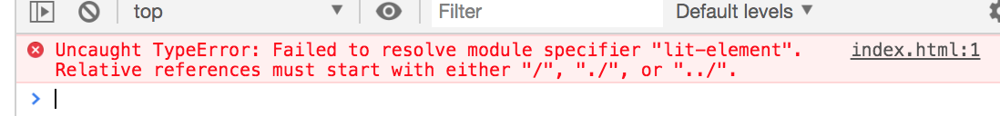
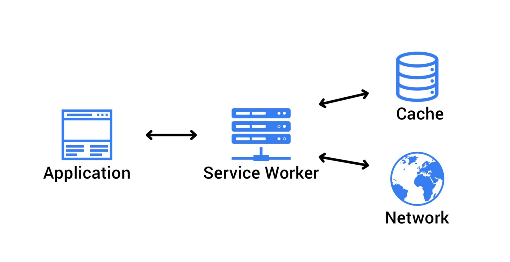

# On The Bleeding Edge 

Hi all 👋

I'm in a long distance relationship, and this means that every few weeks I'm on a plane to England. Everytime I'm on that plane, I think about how nice it'd be to read some reddit posts. What I could do is find a reddit app that lets you cache posts for offline (im sure there is one out there), _or_ I could take the opportunity to write something myself and use some of the latest and greatest technologies and web standards! 

On top of that, there recently has been a lot of discussion around what I like to call "going buildless", which I think is a really fascinating and great recent development. 

I also like to imagine this blogpost as somewhat of an homage to a couple of really awesome people in the community who are making some really awesome things possible, as well as a showcase of some exciting new technologies and standards, and I'll be linking to all that good stuff as we move along.

Do note that this won't be a step-by-step tutorial, but if you want to check out the code, you can find the finished project on [github]().

So let's dive straight in and quickly install _a few_ dependencies:

```bash
npm i @babel/core babel-loader @babel/preset-env @babel/preset-react webpack webpack-cli react react-dom redux react-redux html-webpack-plugin are-you-tired-yet html-loader webpack-dev-server
```

I'm kidding. We're not gonna use any of that. We're going to try and avoid as much tooling as we can, and keep the entry barrier low.

Sorry.

What we _will_ be using is:

- [`LitElement`](https://github.com/polymer/lit-element)
  For this project we'll be using LitElement as our component model. It's easy to use, lightweight, close to the metal, and leverages web components.

- [`@vaadin/router`](https://github.com/vaadin/vaadin-router)
  Vaadin router is a really small (< 7kb) router that has an *awesome* developer experience, and I cannot recommend enough.

- [`@pika/web`](https://github.com/pikapkg/web)
  Pika is going to help us get our modules together for easy development.
  
- [`es-dev-server`](https://open-wc.org/developing/es-dev-server.html)
  A simple dev server for modern web development workflows. Although any http server will do; feel free to bring your own.

And that's it. We'll also be using a few cutting edge browser standards, namely: [es modules](https://hacks.mozilla.org/2018/03/es-modules-a-cartoon-deep-dive/), [web components](https://developer.mozilla.org/en-US/docs/Web/Web_Components), [import-maps](https://github.com/WICG/import-maps), [kv-storage](https://github.com/WICG/kv-storage) and [service-worker](https://developers.google.com/web/fundamentals/primers/service-workers/).

So let's go ahead and install our dependencies:

```bash
npm i -S lit-element @vaadin/router
npm i -D @pika/web es-dev-server
```

We'll also add a `postinstall` hook to our `package.json` that's going to run Pika for us:

```json
  "scripts": {
    "start": "es-dev-server",
    "postinstall": "pika-web"
  }
```

## 🐭 Pika

Pika is a project by [Fred K. Schott](https://twitter.com/FredKSchott), that aims to bring that nostalgic, 2014 simplicity to 2019 web development. Fred is up to all sorts of awesome stuff, for one, he made [pika.dev](https://www.pika.dev/), which lets you easily search for modern JavaScript packages on npm. He also recently gave his talk [Reimagining the Registry](ttps://www.youtube.com/watch?v=2Wwx-lF5NhE) at DinosaurJS 2019, which I highly recommend you watch.

`@pika/web` takes things even one step further. If we run `pika-web`, it'll install our dependencies as single javascript files to a new `web_modules/` directory. If your dependency exports an ES "module" entrypoint in its `package.json` manifest, Pika supports it. If you have any transitive dependencies, Pika will create separate chunks for any shared code among your dependencies. Easy peasy lemon squeezy.

What this means, is that in our case our output will look something like:

```
└─ web_modules/
   ├─ lit-element.js
   └─ @vaadin
        └─ router.js
```

Sweet! That's it. We have our dependencies ready to go as single javascript module files, and this is going to make things really convenient for us later on in this blogpost, just stay tuned! 


## 📥 Import maps

Alright! Now we've got our dependencies sorted out, let's get to work. We'll make an `index.html` that'll look something like this:

```html
<html>
	<!-- head etc -->
	<body>
	  <reddit-pwa-app></reddit-pwa-app>
	  <script src="./src/reddit-pwa-app.js" type="module"></script>
	</body>
</html>
```

And `reddit-pwa-app.js`:

```js

import { LitElement, html } from 'lit-element';

class RedditPwaApp extends LitElement {
  
  // ...
  
  render() {
    return html`
      <h1>Hello world!</h1>
    `;
  }
}

customElements.define('reddit-pwa-app', RedditPwaApp);
```

We're off to a great start. Let's try and see how this looks in the browser so far, so lets start our server, open the browser and... What's this? An error?



Oh boy. 

And we've barely even started. Alright, let's take a look. The problem here is that our module specifiers are _bare_. They are _bare module specifiers_. What this means is that there are no paths specified, no file extensions, they're just... pretty bare. Our browser has no idea on what to do with this, so it'll throw an error.

> ```
> import { LitElement, html } from 'lit-element'; // <-- bare module specifier
> import { Router } from '@vaadin/router'; // <-- bare module specifier
>
> import { foo } from './bar.js'; // <-- not bare!
> ```

Naturally, we could use some tools for this, like webpack, or rollup, or a dev server that rewrites the bare module specifiers to something meaningful to browsers, so we can load our imports. But that means we have to bring in a bunch of tooling, dive into configuration, and we're trying to stay minimal here. We just want to write code! In order to solve this, we're going to take a look at [import maps](https://github.com/WICG/import-maps).

Import maps is a new proposal that lets you control the behavior of JavaScript imports. Using an import map, we can control what URLs get fetched by JavaScript `import` statements and `import()` expressions, and allows this mapping to be reused in non-import contexts. This is great for several reasons, because we can use this to:

- Allow our bare module specifiers to work
- Provide a fallback resolution so that `import $ from "jquery";` can try to go to a CDN first, but fall back to a local version if the CDN server is down
- Enabling polyfilling of, or other control over, [built-in modules](https://github.com/tc39/proposal-javascript-standard-library/) (More on that later, hang on tight!)
- Solve the [nested dependency problem](https://dev.to/open-wc/nested-dependencies-in-frontend-558c) (Go read that blog!)

Sounds pretty sweet, no? Import maps are currently available in Chrome 75+, behind a flag, and with that knowledge in mind, let's go to our `index.html`, and add an import map to our `<head>`:

```html
  <head>
    <script type="importmap">
      {
        "imports": {
          "@vaadin/router": "/web_modules/@vaadin/router.js",
          "lit-element": "/web_modules/lit-element.js"
        }
      }
    </script>
  </head>
```

If we go back to our browser, and refresh our page, we'll have no more errors, and we should see our `<h1>Hello world!</h1>` on our screen.

## 📡 Service worker

Alright, we're going to skip ahead in time a little bit. We've got our dependencies working, we have our router set up, and we've done some API calls to get the data from reddit, and display it on our screen. Going over all of the code is a bit out of scope for this blogpost, but remember that you can find all the code in the [github repo]() if you want to read the implementation details.

Since we're making this app so we can read reddit threads on the airplane it would be _great_ if our application worked offline, and if we could somehow save some posts to read.



Service workers are a kind of JavaScript Worker that runs in the background. You can visualize it as sitting in between the web page, and the network. Whenever your web page makes a request, it goes through the service worker first. This means that we can intercept the request, and do stuff with it! For example; we can let the request go through to the network to get a response, and cache it when it returns so we can use that cached data later when we might be offline. We can also use a service worker to _precache_ our assets. What this means is that we can precache any critical assets our application may need in order to work offline. If we have no network connection, we can simply fall back to the assets we cached, and still have a working (albeit offline) application.

If you're interested in learning more about Progressive Web Apps and service worker, I _highly_ recommend you read [The Offline Cookbook](https://developers.google.com/web/fundamentals/instant-and-offline/offline-cookbook/) by [Jake Archibald](https://twitter.com/jaffathecake). As well as this video tutorial [series](https://www.youtube.com/watch?v=GSSP5BxBnu0&list=PLIiQ4B5FSuphk6P-zg_E3W9zL3J22U4dT) by [Jad Joubran](https://twitter.com/JoubranJad).

So let's go ahead and implement a service worker. In our `index.html`, we'll add the following snippet:

```js
  <script>
    if ('serviceWorker' in navigator) {
      window.addEventListener('load', () => {
        navigator.serviceWorker.register('./sw.js').then(() => {
          console.log('ServiceWorker registered!');
        }, (err) => {
          console.log('ServiceWorker registration failed: ', err);
        });
      });
    }
  </script>
```

We'll also add a [`sw.js`]() file to the root of our project. So we're about to precache the assets of our app, and this is where Pika just made life really easy for us. If you'll take a look at the install handler in the service worker file:

```js
self.addEventListener('install', (event) => {
  event.waitUntil(
    caches.open(CACHENAME).then((cache) => {
      return cache.addAll([
        '/',
        './web_modules/lit-element.js',
        './web_modules/@vaadin/router.js',
        './src/reddit-pwa-app.js',
        './src/reddit-pwa-comment.js',
        './src/reddit-pwa-search.js',
        './src/reddit-pwa-subreddit.js',
        './src/reddit-pwa-thread.js',
        './src/utils.js',
      ]);
    })
  );
});
```

You'll find that we're totally in control of our assets, and we have a nice, clean list of files we need in order to work offline.

## 📴 Going offline

Right. Now that we've cached our assets to work offline, it would be excellent if we could actually save some posts that we can read while offline. There are many ways that lead to Rome, but since we're living on the edge a little bit, we're going to go with: Kv-storage!

### 📦 Built-in modules

There are a few things to talk about here. Kv-storage is a [_built-in module_](https://developers.google.com/web/updates/2019/03/kv-storage#what_are_built-in_modules). Built-in modules are very similar to regular JavaScript modules, except they ship with the browser. It's good to note that while built-in modules ship with the browser, they are _not_ exposed on the global scope, and are namespaced with `std:` (Yes, really.). This has a few advantages: they won't add any overhead to starting up a new JavaScript runtime context (e.g. a new tab, worker, or service worker), and they won't consume any memory or CPU unless they're actually imported, as well as avoid naming collisions with existing code.

Another interesting, if not somewhat controversial, proposal as a built-in module is the [std-toast](https://github.com/jackbsteinberg/std-toast) element, and the [std-switch](https://github.com/tkent-google/std-switch/blob/master/README.md) element.

### 🗃 Kv-storage

Alright, with that out of the way, lets talk about [kv-storage](https://github.com/WICG/kv-storage). Kv-storage (or "_key value_ storage") is fairly similar to localStorage, except for only a few **major** differences, and is layered on top of IndexedDB.

The motivation for kv-storage is that localStorage is synchronous, which can lead to bad performance and syncing issues. It's also limited to exclusively String key/value pairs. The alternative, IndexedDb, is... [hard to use](https://youtu.be/cmGr0RszHc8?t=1927). The reason it's so hard to use is that it predates promises, and this leads to a, well, pretty bad developer experience. Not fun. Kv-storage, however, is a lot of fun, asynchronous, _and_ easy to use! Consider the following example:

```js
import { storage, /* StorageArea */ } from "std:kv-storage";

(async () => {
  await storage.set("mycat", "Tom");
  console.log(await storage.get("mycat")); // Tom
})();
```

> Notice how we're importing from `std:kv-storage`?

Pretty neat. We can perfectly use this for adding a 'save for offline' button, and simply store the JSON data for a reddit thread, and get it when we need it.

`reddit-pwa-thread.js:52`:

```js
async saveForOffline() {
  await savedPosts.set(this.location.params.id, this.thread);
  this.isPostSaved = true;
}
```

### 🔮 Polyfilling

Excellent. However, we're about to run into another problem here. Living on the edge is fun, but also dangerous. The problem that we're hitting here is that, at the time of writing, kv-storage is only implemented in Chrome behind a flag. That's obviously not great. Fortunately, there's a polyfill available, and at the same time we get to show off yet another really useful feature of import-maps; polyfilling!

First things first, lets install the kv-storage-polyfill:

`npm i -S kv-storage-polyfill`

> Note that our `postinstall` hook will run Pika for us again

And lets add the following to our import map in our `index.html`:

```html
<script type="importmap">
  {
    "imports": {
      "@vaadin/router": "/web_modules/@vaadin/router.js",
      "lit-element": "/web_modules/lit-element.js",
      "/web_modules/kv-storage-polyfill.js": [
        "std:kv-storage",
        "/web_modules/kv-storage-polyfill.js"
      ]
    }
  }
</script>
```

So what happens here is that whenever `/web_modules/kv-storage-polyfill.js` is requested or imported, the browser will _first_ try to see if `std:kv-storage` is available; however, if that fails, it'll load `/web_modules/kv-storage-polyfill.js` instead.

So in code, if we import:

```js
import { StorageArea } from '/web_modules/kv-storage-polyfill.js';
```

This is what will happen:

```
"/web_modules/kv-storage-polyfill.js": [     // when I'm requested
  "std:kv-storage", 		             // try me first!
  "/web_modules/kv-storage-polyfill.js"      // or fallback to me
]
```

## 🎉 Concluding

And we should now have a simple, functioning PWA, with minimal dependencies. There are a few nitpicks to this project that we could complain about, and they'd all likely be fair. For example; we probably could've gone without using Pika, but it does make life really easy for us. You could have made the same argument about adding a simple Webpack configuration, but you'd have missed the point. The point here is to make a fun application, while using some of the latest features, drop some buzzwords, and have a low barrier for entry. As Fred Schott would say: "In 2019, you should use a bundler because you want to, not because you need to."

If you're interested in nitpicking, however, you can read [this great discussion](https://github.com/lukejacksonn/perflink/issues/15) about using Webpack vs Pika vs buildless, and you'll get some great insights from [Sean Larkinn](https://twitter.com/TheLarkInn) of the Webpack core team himself, as well as [Fred K. Schott](https://twitter.com/FredKSchott), creator of Pika.

I hope you enjoyed this blog post, and I hope you learned something, or discovered some new interesting people to follow. There are lots of exciting developments happening in this space right now, and I hope I got you as excited about them as I am. If you have any questions, comments, feedback, or nitpicks, feel free to reach out to me on twitter at [@passle_](https://twitter.com/passle_).

## Honorable mentions

To close this blog, I'd like to give a few shoutouts to some very interesting people that are doing some great stuff, and you may want to keep an eye on.

To start: [Guy Bedford](https://twitter.com/guybedford), who wrote [es-module-shims](https://github.com/guybedford/es-module-shims
), which, well, shims es modules. Which if you ask me is quite an amazing feat, and allows modules and import maps to work all the way down to IE11.

And if you're interested in more of the same, you should definitely check out [Luke Jackson](https://twitter.com/lukejacksonn)'s talk [Don't Build That App!](https://www.youtube.com/watch?v=mVjZQrsXBQE) No webpack, no worries 🤓🤙, as Luke would say.


# TO DO:

browser/device support disclaimer